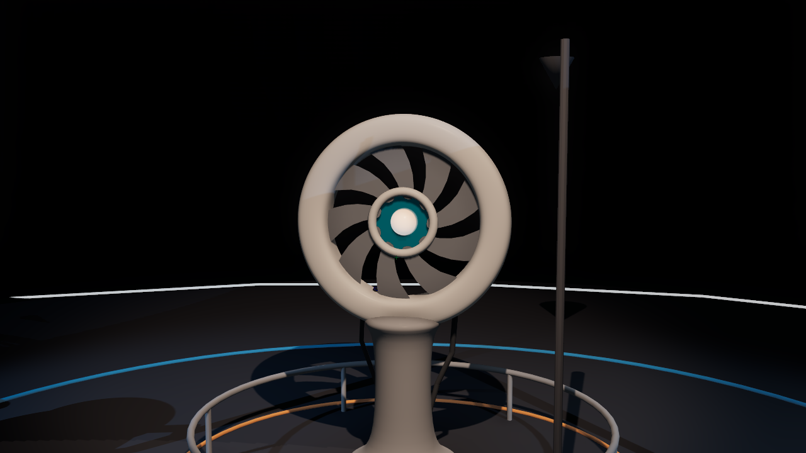
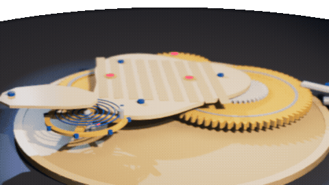
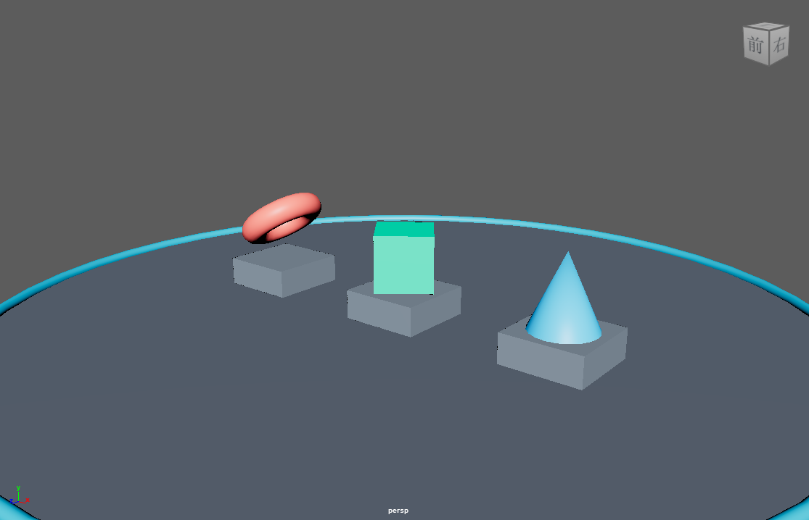
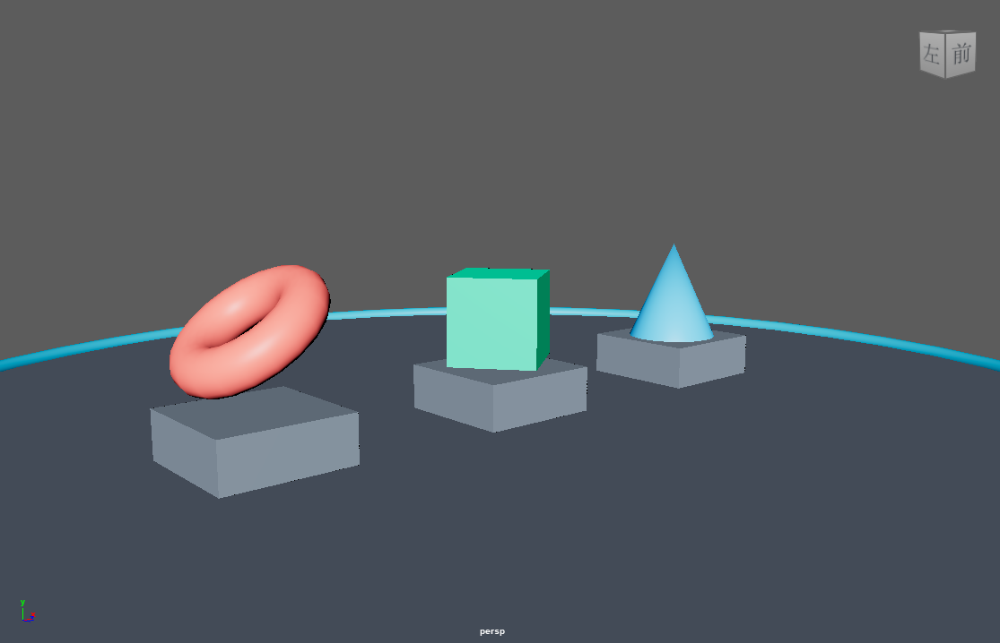

<p align="center">
  
</p>

# mcp-for-maya

> 让 AI Agent 拥有 Maya 三维空间感知能力的 MCP 服务器

[English](README_en.md) | 中文

[](https://github.com/Xxx91n/mcp-for-maya/actions/workflows/ci.yml) [](https://pypi.org/project/mcp-for-maya/) [](LICENSE) [](https://pypi.org/project/mcp-for-maya/)

## 这是什么

`mcp-for-maya` 是一个 [Model Context Protocol (MCP)](https://modelcontextprotocol.io/) 服务器，让大语言模型（Codex、Claude 等）直接操控 Autodesk Maya，进行三维建模、场景规划和工程级项目落地。

本项目 fork 自 [chadrik/maya-mcp-server](https://github.com/chadrik/maya-mcp-server)，在其连接层之上扩展了场景智能层：空间感知、工程审核、事务安全与视觉闭环。

**核心能力：** AI 不再是"闭眼写代码"，而是能随时感知 Maya 场景的空间状态、材质分布、物体关系，并基于工程规范进行确定性审核。

> [!WARNING]
> 本服务器把任意 Python 代码送进 Maya 执行——这是设计能力而非漏洞。内置的校验/限流/审计是**误操作与注入指令的安全网，不是抵御恶意客户端的边界**；接入的 Agent 是受信方。详见 [docs/threat-model.md](docs/threat-model.md)。


以下素材全部由本产品工具链真实捕获，非 mock：演示场景经 `execute_code` 构建，视口截图来自 `scene_viewport_snapshot`，环绕序列来自 `camera_orbit` + `scene_render_preview`（Maya 2024 GUI 会话；场景中 RGB 三色呼应 logo 的三轴意象）。

<p align="center"></p>

<p align="center">


</p>

## 与 blender-mcp 对比

对标 [ahujasid/blender-mcp](https://github.com/ahujasid/blender-mcp)（2026-09 实测），诚实三档：

| 档位 | 内容 |
|------|------|
| **本项目独有** | ICEV 强制工作流（写进服务端 instructions）、CoS 记号化输出、checkpoint/rollback 事务安全、scene_plan 场景规划（zone 语义+布局建议）、多会话管理、11 项确定性审核、带元数据的 playblast 渲染预览 |
| **blender-mcp 独有** | 资产生态链（Poly Haven/Sketchfab/Hyper3D/Hunyuan3D）、一等对象 CRUD 工具面、AI 生成模型接入、社区规模 |
| **双方共有** | MCP 工具面、视口截图回传、任意 Python 执行、本地 socket 连接 |

资产集成在我们的路线图上（Poly Haven 薄集成，issue #2）；AI 生成与一等对象 CRUD 明确不做——后者 `execute_code` 已覆盖。


| 能力 | 工具 | 说明 |
|------|------|------|
| 🧊 **空间感知** | `scene_snapshot` `scene_inspect` `scene_measure` | 一次调用获取全场景空间模型，精确距离/重叠/间隙测量 |
| 🎨 **审美分析** | `scene_aesthetics` | 5 维分析：色彩理论(60-30-10)、空间构成(黄金比例/三分法)、比例尺度(人体工学)、光照质量(三点照明/填充比/色温/衰减)、视觉动线 |
| 🎬 **镜头规划** | `camera_create` `camera_orbit` | 8 种行业标准镜头 + 环绕动画 |
| 🛡️ **避灾回退** | `scene_checkpoint` `scene_rollback` `scene_checkpoint_list` | exportAll 内存态快照，回滚显式重绑原路径 |
| 🧠 **大局观统筹** | `scene_plan` | 组织健康检查、区域平衡、布局优化建议、冲突预防、自然语言规划 |
| 📋 **工程审核** | `scene_review` `scene_validate` `scene_assert` | 11 项确定性检查（0-100 分）+ 自定义约束验证 + 状态断言 |
| ⚡ **代码执行** | `execute_code` `write_module` | 在 Maya 中执行任意 Python 代码 / 注入可复用模块 |
| 👁️ **视觉闭环** | `scene_viewport_snapshot` `scene_render_preview` | 视口所见即所得捕获 + 单帧 playblast 预览（仅 GUI 会话） |
| 🔌 **会话管理** | `list_sessions` `add_session` `maya_setup_guide` | 多会话发现/接入 + 连接诊断/安装/回退引导 |

共 20 个 MCP 工具。


### 1. 安装

```bash
# PyPI 安装（推荐）
pip install mcp-for-maya

# 或 uvx 免安装直跑
uvx mcp-for-maya

# 备选：用 uv 直接从 git 安装
uv tool install git+https://github.com/Xxx91n/mcp-for-maya.git

# 或克隆源码安装
git clone https://github.com/Xxx91n/mcp-for-maya.git
cd mcp-for-maya
pip install -e .
```

> [!NOTE]
> **三层命名**：dist 名 `mcp-for-maya`（PyPI 货架名）→ 安装后 import 名为 `maya_mcp_server`（继承上游不改）；script 名 `mcp-for-maya`（旧名 `maya-mcp-server` 保留为兼容别名）。`uvx mcp-for-maya` 能命中正是因为命令名与包名一致。

### 2. 配置 Maya 连接

#### 方式一：自动配置（推荐）

启动 MCP 服务器后，AI Agent 会自动调用 `maya_setup_guide` 工具引导连接：

1. 确保 Maya 已启动
2. 在 Agent 中输入任意指令（如"查看 Maya 场景"）
3. 如果未连接，Agent 会自动运行诊断并可安装 `userSetup.py`（幂等标记块合并，写入前自动备份）
4. 重启 Maya 后，命令端口自动打开

#### 方式二：手动配置

在 Maya 的脚本编辑器中执行：

```python
import maya.cmds as cmds
cmds.commandPort(name=':7001', sourceType='python')
```

> **提示**: Script Editor 打开方式：Maya 菜单 → Windows → General Editors → Script Editor；确保语言选择器为 **Python**（不是 MEL）。

#### 方式三：永久自动连接

将以下内容保存为 `userSetup.py`，放入 Maya 的 scripts 目录：

| 平台 | 路径 |
|------|------|
| Windows | `%MAYA_APP_DIR%\<version>\scripts\` |
| Linux | `~/maya/<version>/scripts/` |
| macOS | `~/Library/Preferences/Autodesk/maya/<version>/scripts/` |

```python
import maya.cmds as cmds
cmds.evalDeferred('cmds.commandPort(name=":7001", sourceType="python")', lowestPriority=True)
```

#### 故障排查

| 问题 | 解决方案 |
|------|----------|
| `list_sessions` 返回空 | 调用 `maya_setup_guide(action="diagnose")` |
| 端口被占用 | 关闭其他 Maya 实例，或换端口 |
| userSetup.py 不生效 | 确认文件在正确的 scripts 目录，重启 Maya |
| 防火墙拦截 | 确保 localhost:7001 可访问 |

### 3. 配置 MCP 客户端

Codex `~/.codex/config.toml`：

```toml
[mcp_servers.maya]
command = "uvx"
args = ["mcp-for-maya"]
tool_timeout_sec = 120
```

走 git 源则 `args = ["--from", "git+https://github.com/Xxx91n/mcp-for-maya.git", "mcp-for-maya"]`。源码安装改用 `command = "python"`、`args = ["-m", "maya_mcp_server"]`，并在 `env` 中把 `PYTHONPATH` 指到 `<repo>/src`。

### 4. 开始使用

在 Agent 中直接对话：

> "帮我看看 Maya 场景里有什么，然后在入口处创建一个展示架"

AI 会自动调用 `scene_snapshot()` → 理解场景 → 执行建模 → `scene_review()` 审核结果。


每次场景修改都遵循 **ICEV** 工作流（也内置为 Agent 流程卡，见 `skills/icev-workflow`）：

```
┌──────────┐     ┌──────────┐     ┌──────────┐     ┌──────────┐
│ INSPECT  │ ──→ │ COMPUTE  │ ──→ │ EXECUTE  │ ──→ │ VERIFY   │
│ 场景快照  │     │ 计算规划  │     │ 执行修改  │     │ 审核验证  │
└──────────┘     └──────────┘     └──────────┘     └──────────┘
```

1. **INSPECT**：`scene_snapshot()` 获取全场景空间数据
2. **COMPUTE**：基于空间数据计算位置、尺寸、间距
3. **EXECUTE**：`execute_code()` 执行 Maya Python 代码
4. **VERIFY**：`scene_assert()` + `scene_review()` 确认结果；GUI 会话可用视觉工具复核

## 工具详解

### 空间感知

```python
# 全场景快照（一次调用，返回所有物体的空间数据）
scene_snapshot(detail="compact", format="cos")

# 深度检查特定物体（含邻居分析）
scene_inspect(target="wall_entrance", include_neighbors=True)

# 精确测量（4 种模式）
scene_measure(obj_a="wall_north", obj_b="counter_A", mode="clearance")

# 验证场景状态
scene_assert(expectations='{"wall": {"exists": true, "position": [0,0,500]}}')
```

### 工程审核

```python
# 11 项确定性检查（返回 0-100 分）
scene_review()

# 空间约束验证
scene_validate(rules='[{"type": "min_clearance", "value": 180}]')
```

### 镜头规划

```python
# 创建镜头（8 种行业标准类型）
camera_create(target="product_display", shot_type="medium", azimuth=30, elevation=15)
# 类型：extreme_wide / wide / medium / close / extreme_close / bird_eye / low_angle / over_shoulder

# 环绕动画相机
camera_orbit(center=[0, 100, 0], radius=500, frames=120)
```

### 避灾回退

```python
# 保存检查点（快照=内存态 exportAll，不含 undo 历史）
scene_checkpoint(name="before_renovation")

# 列出所有检查点
scene_checkpoint_list()

# 回滚（先自动存安全快照，再把场景名重绑回原文件；回滚后请用 scene_snapshot 重建认知）
# 边界：快照自包含——references 默认展平不回写；假定单场景文件单会话
scene_rollback(filename="cp_before_renovation.ma")
```

### 视觉闭环（仅 GUI 会话）

```python
# 视口所见即所得截图（含 HUD/选中高亮——验证用户正看到什么）
scene_viewport_snapshot(max_size=800, format="jpeg")

# 单帧 playblast 预览（干净无 HUD；可指定相机，width/height 服务端向上取整 /4）
scene_render_preview(camera="CAM_hero", width=640, height=360)

# 两工具返回 [图片, JSON 元数据]；headless 会话返回 gui_session_required 错误
# wireframe/线稿审查建议 format="png"；实际尺寸以返回元数据为准
```

## CoS 符号化格式

默认输出使用 **Chain-of-Symbol** 记号化格式压缩场景数据。该格式论文报告在其演示场景上较 JSON 节省约 65% token（arXiv:2305.10276，-65.8%）——本项目实现该记号，此数字为论文测量值而非本项目基准测试。

```
SCENE[164obj, 5zones] UNIT=cm UP=y
shell (23obj) @(-11.8,178.8,145.7)
  GRP_floor[mesh]@(0,0,0) 1121.5x20x1530.5
  pasted__arch_wall[mesh]@(0,0,0) 100x300x10
entrance (6obj) @(157.3,162.6,-111.6)
  GRP_workshopFront[group]@(1162,-17,103) 227.4x200.9x193.3
```

## Agent Skills

仓库内置 2 张 **Experimental** 流程卡（`skills/` 目录）：

| Skill | 用途 |
|-------|------|
| `skills/icev-workflow` | ICEV 修改纪律：任何场景变更必走 Inspect→Compute→Execute→Verify |
| `skills/scene-review-playbook` | 审核手册：11 项检查的分值解读与 findings→actions 映射 |

> 两卡仅在 Claude Code 上评测过，未在 Codex/Gemini CLI/Cursor 验证；跨模型评测计划见 issue #3。


`scene_review()` 提供 11 项通用检查（0-100 分，按各项分值归一化）：

| 检查 | 分值 | 检查内容 |
|------|------|----------|
| spatial | 10 | 物体/相机/灯光计数 |
| overlaps | 10 | BBox 碰撞检测（排除父子） |
| conflicts | 10 | 空间穿透检测 |
| zones | 5 | 命名规则区域覆盖 |
| naming | 5 | 生产命名规范 |
| components | 10 | GRP_ 分组 + 嵌套深度 ≤4 |
| orphans | 5 | 空组/默认名检测 |
| aesthetics | 15 | 5 维审美（色彩/构成/比例/光照/动线） |
| lighting | 10 | 三点照明/填充比/衰减 |
| organization | 10 | 层级组织健康度 |
| constraints | 5 | 自定义约束违反 |

## 信任与隐私

- **零遥测**：zero telemetry, no phone-home——本项目不含任何遥测或外发上报代码，可源码核实。
- **本地单用户**：命令端口仅绑定 localhost；接入的 MCP client 是受信方。
- **安全网**：统一管线对全部 20 个工具做参数校验 + token-bucket 限流（读取类 ~100 次/60s、变更类 ~20 次/60s，按会话）+ pattern 扫描（默认 warn-only）+ 独立 JSONL 审计日志。它防误操作，不防恶意 client——完整模型见 [docs/threat-model.md](docs/threat-model.md)。
- **事务安全**：`scene_checkpoint`/`scene_rollback` 提供内存态快照与显式回滚（快照不含 undo 历史，references 默认展平）。
- 漏洞报告渠道见 [SECURITY.md](SECURITY.md)。

## 版本策略

遵循 [Semantic Versioning](https://semver.org/)：

- **0.x（当前 0.1.0，Alpha）**：工具面仍可能调整；minor bump 承载新功能，不承诺兼容冻结。
- **Beta**：feature-complete 且开始外部测试后晋升（classifier 同步升 `4 - Beta`）。
- **1.0.0**：公共 API 冻结承诺，与 `5 - Production/Stable` classifier 同一提交晋升。

发布节奏为里程碑驱动，不承诺固定周期。路线图见 GitHub issues：#2 Poly Haven 薄集成（v1.1）、#3 Skills 正式立项（v1.x）、#4 安全与权限模型（v1.x）、#5 export_scene+场景图内省（v1.x）、#6 更多资产源（exploratory）、#7 真机验证清单与 v1.0 反馈（pinned）。

## 环境要求

- Autodesk Maya **2024+**（Maya 自带 Python 3.10+）；视觉闭环两个工具需要 **GUI 会话**（headless/mayapy 返回结构化能力错误）。
- 宿主 Python **≥3.10**；Windows / Linux / macOS。

## 开发

```bash
pip install -e ".[dev]"          # 或 uv pip install -e ".[dev]"
python -m pytest tests/ -q       # 测试
ruff check src tests             # lint
mypy src                         # 类型检查
python -m maya_mcp_server -vv    # DEBUG 日志运行（-v=INFO, -vv=DEBUG）
```

贡献流程见 [CONTRIBUTING.md](CONTRIBUTING.md)；变更记录见 [CHANGELOG.md](CHANGELOG.md)。

## 致谢

Fork 自 [chadrik/maya-mcp-server](https://github.com/chadrik/maya-mcp-server)——保留其 MIT 版权声明（见 LICENSE），在其连接层之上扩展场景智能层。
